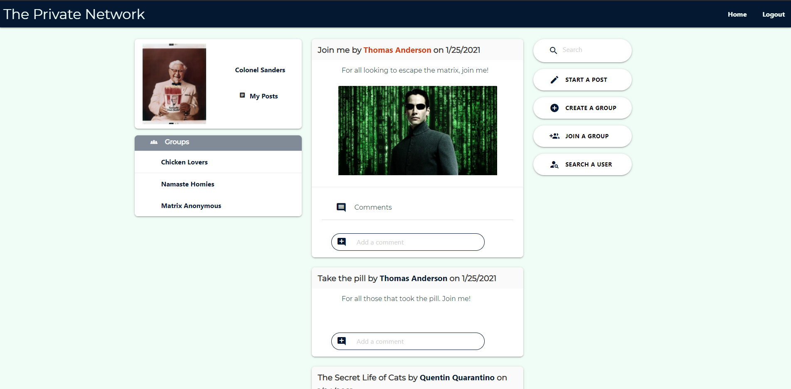

# The Private Network

## Description
A social media app designed for use on personal and private servers.  Enjoy a space free from ads and sponsored posts with only your close friends and family.  Use the apps to create users, groups, and posts.  Join groups to keep your posts organized and relevant. Comment on posts, search posts, and view posts by users and groups.  Stay in touch with friends and family without scrolling through long feeds filled with unwanted content.  Make your matrix escape today!  View walkthrough video [here](https://drive.google.com/file/d/1GFTollNNLNk8498ZTuFV3elpS1hQ3FDv/view)
## Table of Contents
* [Installation](#Installation)
* [Usage](#Usage)
* [License](#License)
* [Contributing](#Contributing)
* [Tests](#Tests)
* [Questions](#Questions)
## Installation
1. Download this repo.
2. Open your terminal and run npm install.
3. Create a .env file to store your database account information.
4. Open the server.js file and use your cloudinary information on line 11.
4. In your terminal, run npm start.
## Usage
This app requires a mysql database and cloudinary account in order to function properly. To demo a deployed version on heroku, click [here](https://the-private-network.herokuapp.com/)
## License
This project is covered under the ISC license.
## Contributing
Contact us for more information.
## Tests
Not open to testing at this time.
## Questions
GitHub: [github.com/hcs847](http://github.com/hcs847)  
Email: [stephenbeiter@gmail.com](mailto:stephenbeiter@gmail.com)
## Created by
### Hila Caspi, Stephen Beiter, and Arun Chowdhury
